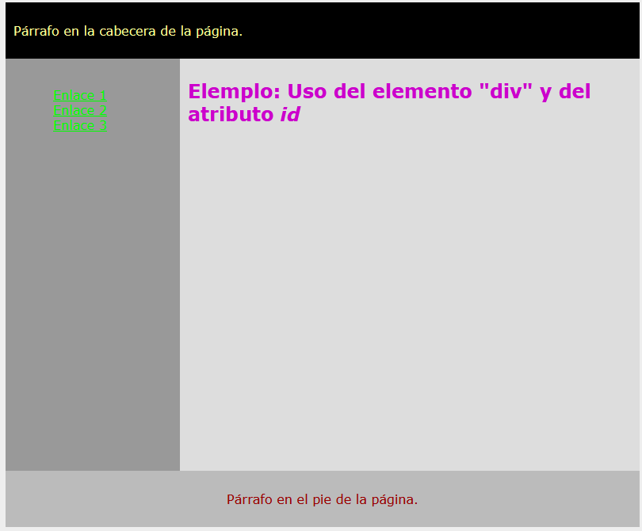

# ESTRUCTURA BÁSICA V1

Crea una página web que replique el contenido de esta imagen:

Los id de los divs de arriba a abajo y de izquierda a derecha deben de mantener la siguiente correspondencia:

- cabeceira
- navegacion
- contido
- pe

Prueba a validar tu trabajo a través de http://validator.w3.org

Documentación a entregar:

APELLIDO1_APELLIDO2_NOMBRE_Estructura_basica_v1.html
