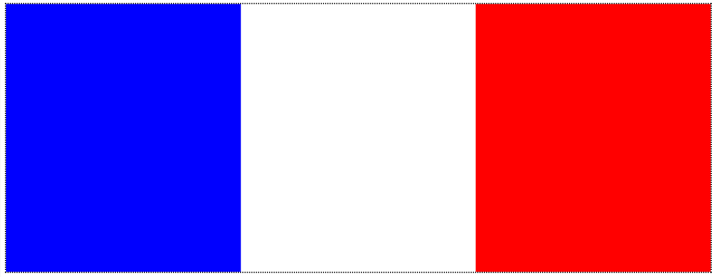
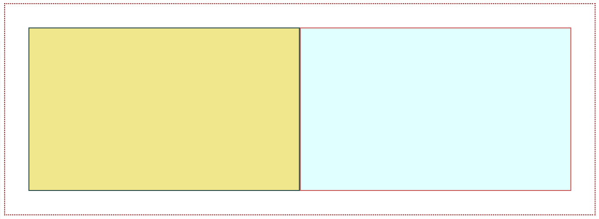
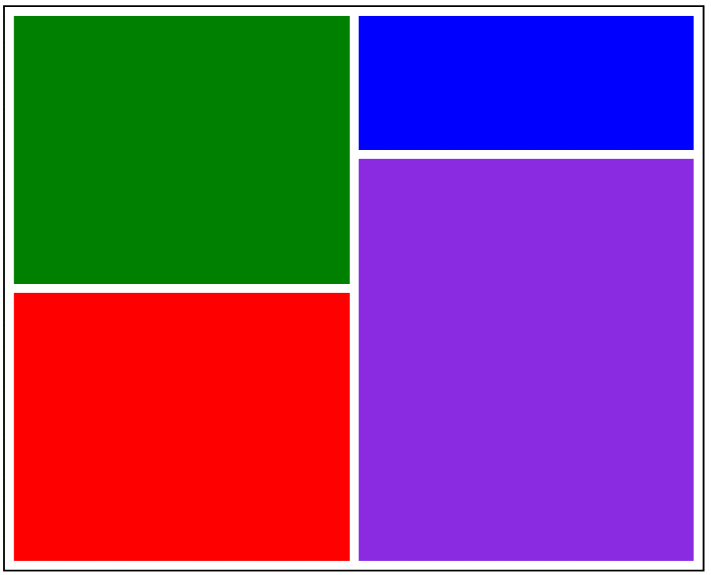
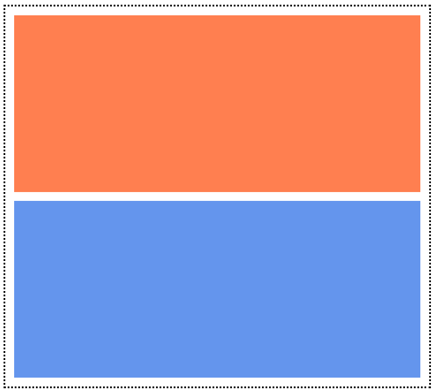

# POSICIONAMIENTO

1. Crea tres versiones de una página web que replique el contenido de esta imagen empleando principalmente la etiqueta div y sus propiedades mediante el método *float*, el método *flexbox* y el método *grid*:

   

2. Crea tres versiones de una página web que replique el contenido de esta imagen empleando principalmente la etiqueta div y sus propiedades mediante el método *float*, el método *flexbox* y el método *grid*:

   

3. Crea tres versiones de una página web que replique el contenido de esta imagen empleando principalmente la etiqueta div y sus propiedades mediante el método *float*, el método *flexbox* y el método *grid*:

   

4. Crea tres versiones de una página web que replique el contenido de esta imagen empleando principalmente la etiqueta div y sus propiedades mediante el método *float*, el método *flexbox* y el método *grid*:

   

5. Crea una página web que replique el contenido de esta imagen empleando principalmente la etiqueta div y sus propiedades mediante el método que te resulte más cómodo: *float*, *flexbox* o *grid*:

   

Documentación a entregar (carpeta comprimida con los diferentes archivos .html):

APELLIDO1_APELLIDO2_NOMBRE_Posicionamiento.zip
