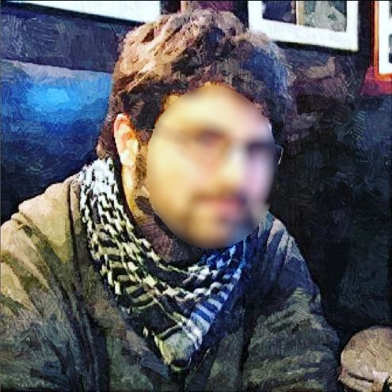
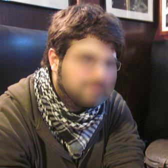
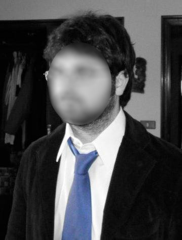
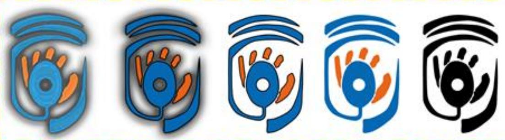

# CREACIÓN Y EDICIÓN DE IMÁGENES

## ACTIVIDAD 1

Realiza las siguientes ediciones digitales sobre dos fotografías propias (no importa si son antiguas) empleando un editor de imágenes a tu elección que implemente un sistema de gestión de capas.

1. Abre la imagen con el editor.
2. Aplica un filtro y los ajustes de brillo, color y contraste que consideres.
3. Repite con la segunda imagen aplicando un filtro diferente.

Ejemplo:

 

Documentación a entregar:

APELLIDO1_APELLIDO2_NOMBRE_ManejoDeFiltros.rar

Ese archivo debe contener dos carpetas con el siguiente contenido:

```
/imagen1
    APELLIDO1_APELLIDO2_NOMBRE_ArchivoDeEdicion.*
    APELLIDO1_APELLIDO2_NOMBRE_ImagenOriginal.png
    APELLIDO1_APELLIDO2_NOMBRE_ImagenEditada.png

/imagen2
    APELLIDO1_APELLIDO2_NOMBRE_archivo_de_edicion.*
    APELLIDO1_APELLIDO2_NOMBRE_imagen_original.png
    APELLIDO1_APELLIDO2_NOMBRE_imagen_editada.png
```

\*El formato que corresponda: *.psd*, *.xcf*, *.cdr*, etc.

## ACTIVIDAD 2

Realiza las siguientes ediciones digitales sobre dos fotografías propias (no importa si son antiguas) empleando un editor de imágenes a tu elección que implemente un sistema de gestión de capas.

1. Abre la imagen con el editor.
2. Duplica la capa de la imagen.
3. Aplica un filtro *blanco y negro* a la capa duplicada.
4. Elimina alguna sección de la capa duplicada para dejar ver la imagen en color original que se encuentra por debajo.
5. Repite el proceso en la segunda imagen.

Ejemplo:

  

Documentación a entregar:

APELLIDO1_APELLIDO2_NOMBRE_ManejoDeCapas.rar

Ese archivo debe contener dos carpetas con el siguiente contenido:

```
/imagen1
    APELLIDO1_APELLIDO2_NOMBRE_ArchivoDeEdicion.*
    APELLIDO1_APELLIDO2_NOMBRE_ImagenOriginal.png
    APELLIDO1_APELLIDO2_NOMBRE_ImagenEditada.png

/imagen2
    APELLIDO1_APELLIDO2_NOMBRE_archivo_de_edicion.*
    APELLIDO1_APELLIDO2_NOMBRE_imagen_original.png
    APELLIDO1_APELLIDO2_NOMBRE_imagen_editada.png
```

\*El formato que corresponda: *.psd*, *.xcf*, *.cdr*, etc.

## ACTIVIDAD 3

Diseña un logotipo para una asociación/organización/empresa (ficticio o real), empleando una herramienta de diseño y edición de imágenes a tu elección.

Para la elaboración del logotipo se permite emplear imágenes obtenidas de Internet, tipografías, etc.

El logotipo debe de tener varias variantes que permitan su uso en diferentes formatos de diseño:

- Logotipo original.
- Logotipo con fondo transparente (formato para uso en documentos).
- Logotipo en blanco y negro (formato de impresión).
- Logotipo minimalista (simplificación del logotipo).

Ejemplo:



Documentación a entregar:

APELLIDO1_APELLIDO2_NOMBRE_Logotipo.rar

Ese archivo debe contener los siguientes archivos:

```
APELLIDO1_APELLIDO2_NOMBRE_Logotipo.*
APELLIDO1_APELLIDO2_NOMBRE_Logotipo.png
APELLIDO1_APELLIDO2_NOMBRE_Logotipo.jpg
APELLIDO1_APELLIDO2_NOMBRE_LogotipoBlancoNegro.png
APELLIDO1_APELLIDO2_NOMBRE_LogotipoMinimalista.png
```

\*El formato que corresponda: *.psd*, *.xcf*, *.cdr*, etc.
